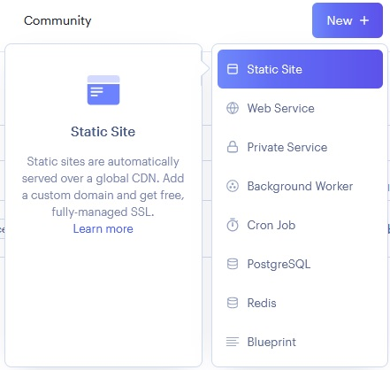
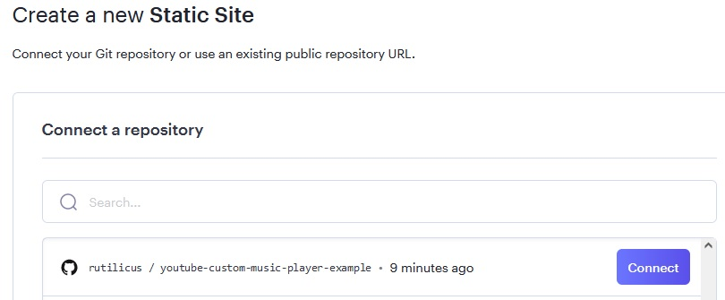
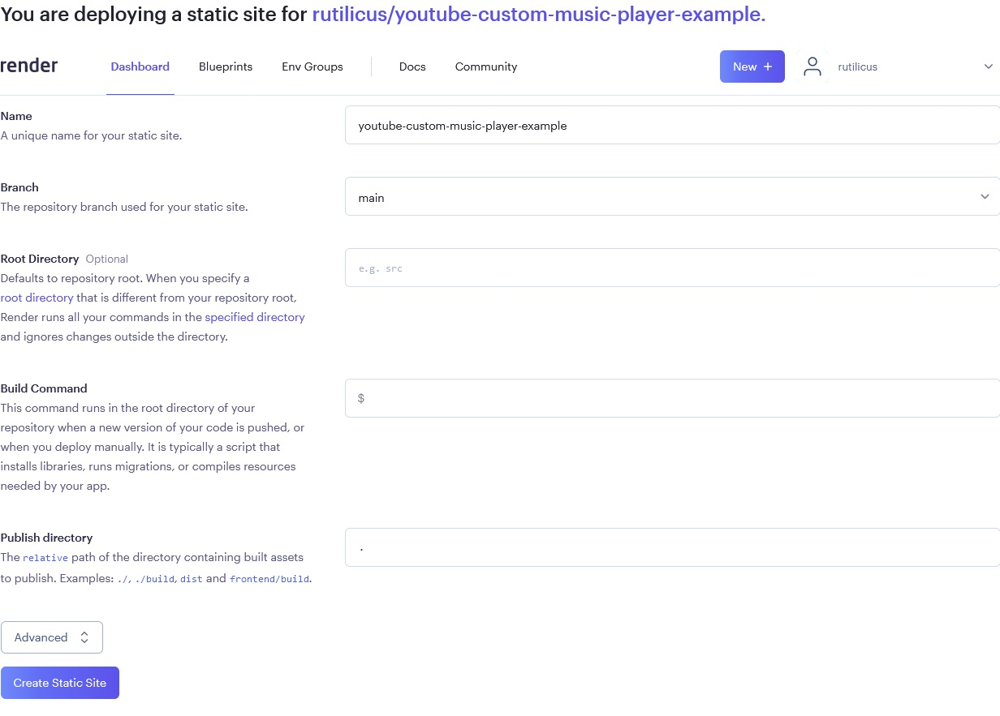
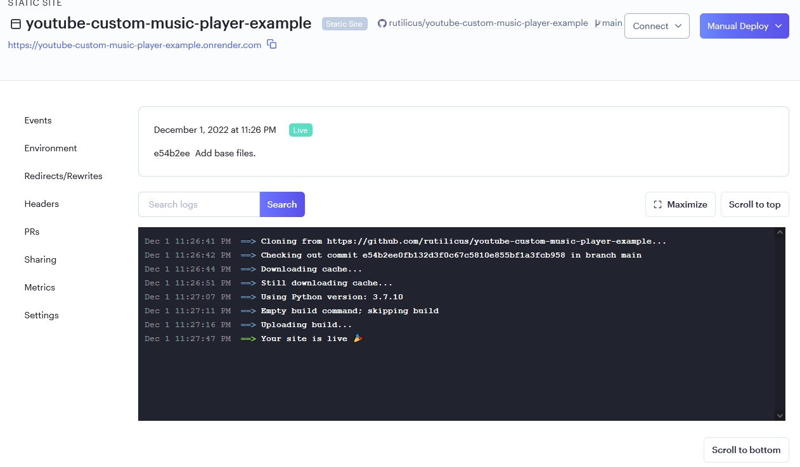

# About this repository
This is an example repository of deployment for [youtube-custom-music-player](https://github.com/rutilicus/youtube-custom-music-player).
This document describes first step to deploy to [Render](https://render.com/).
An example of deployment result is in [here](https://youtube-custom-music-player-example.onrender.com/).

# First step to deploy to Render
1. Create a git repository on GitHub for your site.
2. Download a release of [youtube-custom-music-player](https://github.com/rutilicus/youtube-custom-music-player), extract files, and commit the files, like this repository (except README.md and files in doc directory). Or, fork this repository will work.
3. Create an account of Render and sign in.
4. Select [New] -> [Static Site].

5. Connect your GitHub account and repository.

6. Input only a name of static site, and create static site.

7. If the settings are fine, the site is live.

# Next step
Edit song_list.csv and config.json in data directory, and create your own site!
